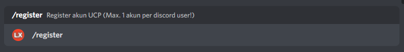
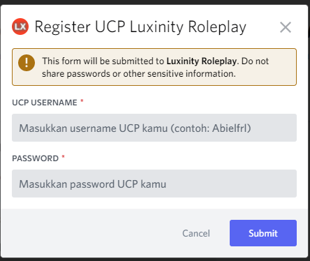
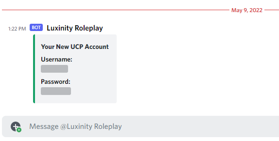

Untuk bisa bermain di server kami kalian diharuskan untuk mendaftarkan akun di server kami, Karena di server kami memiliki system UCP (*User Control Panel*) dimana kalian baru bisa masuk atau bermain di server kami setelah kalian pendaftarkan akun kalian di server kami. Bagaimana cara mendaftarkan akun di server luxinity ? 

Silahkan ikuti cara di bawah ini :

## Registrasi/Daftar User pada Discord Server Luxinity

:::info
Anda perlu menyalakan fitur DM server di discord anda, agar kami dapat mengirimkan detail akun UCP anda.
:::

1. Pertama, Anda harus masuk kedalam discord server kita. Jika belum, Silahkan [Join](https://discord.gg/sCJj8JUrNd) terlebih dahulu.

2. Bacalah terlebih dahulu [rules discord server kami](https://discord.com/channels/812150001089118210/850304670966743050)

3. Setelah anda telah menyetujui [rules server](https://discord.com/channels/812150001089118210/850304670966743050/971799833734156291) kami, Kunjungi channel [`🤖・bot-cmds`](https://discord.com/channels/812150001089118210/913703387952984084)

4. Di channel tersebut, gunakan *slash commands* `/register` untuk memunculkan form register

5. Form registrasi akan segera muncul, Isilah form tersebut dengan benar.

6. Setelah form telah terisi, klik tombol "Submit".

7. Anda akan menerima Username dan Password anda melalui DM, dan registrasi anda telah selesai. Anda dapat langsung masuk kedalam server kami.

## F.A.Q (Frequently Asked Questions)

- Q: Apakah Saya dapat me-register banyak akun UCP per akun discord?
  A: **Tidak Bisa.** Untuk menghindari adanya spam dan ban evading, Kami hanya mengijinkan 1 akun discord mempunyai 1 akun UCP.

- Q: Saya sudah register, kenapa bot nya tidak mengirimkan DM kepada saya?
  A: Kemungkinan DM anda dimatikan, silahkan nyalakan DM anda di menu Settings -> Privacy. Namun dengan catatan, anda tidak dapat me-registrasi ulang kembali.